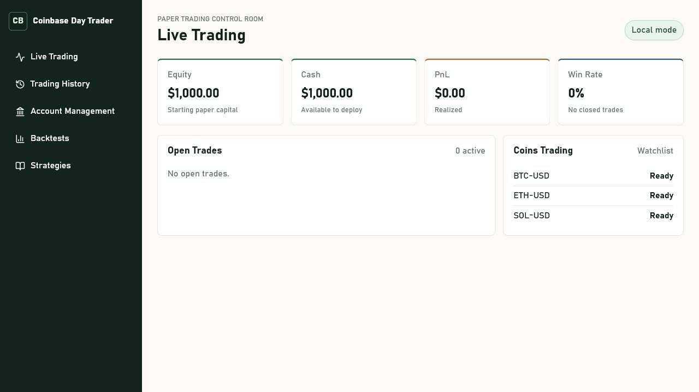

# Coinbase Day Trader v1

Local-first Coinbase crypto paper trading bot and dashboard.

## Financial Disclaimer

This project is experimental software. The owner is not a financial professional, and this repository does not provide financial advice. Do not use this software for live trading unless you understand the risks and have reviewed the code, configuration, exchange permissions, and strategy behavior yourself.

## Current Safety Mode

Version 0.1.0 supports local paper trading first. Coinbase integration is wired for sandbox/public API checks, but live order placement is intentionally blocked.

## Quick Start

1. Copy `.env.example` to `.env`.
2. Fill only the values you need for local testing.
3. Install Python dependencies with `pip install -e .[dev]`.
4. Start the bot with `powershell -File scripts/start_bot.ps1 -Strategies ALL`.
5. Start the dashboard with `powershell -File scripts/start_dashboard.ps1`.

## Coinbase Setup

Create Coinbase API credentials from Coinbase Developer Platform or Advanced Trade with the least permissions needed for sandbox and market-data testing. Store keys only in `.env` or another ignored local secret file. Do not commit `.env`, `cdp_api_key.json`, or any API key export.

In v0.1.0, `TRADING_MODE=paper` is the safe default. `TRADING_MODE=coinbase_sandbox` is reserved for integration smoke checks. `TRADING_MODE=live` fails closed.

## Bot Commands

```powershell
trader start-bot --strategies ALL
trader start-bot --strategies price_action_transcript
trader reset-safety
```

The bot starts from 1000 USD paper cash. If equity falls to 500 USD or below, trading is disabled until `trader reset-safety` is run manually.

## Dashboard



Run locally:

```powershell
powershell -File scripts/start_dashboard.ps1
```

## Strategies

- `price_action_transcript`: price-action strategy shell gated on transcript review from the requested YouTube video.

## Backtests

Standard periods are 2024, 2025, 2026, and the last 30 days. Each run starts with 1000 USD paper cash.

## Verification

Backend:

```powershell
pytest -v
```

Dashboard:

```powershell
npm --prefix dashboard test -- --run
npm --prefix dashboard audit --audit-level=moderate
```
