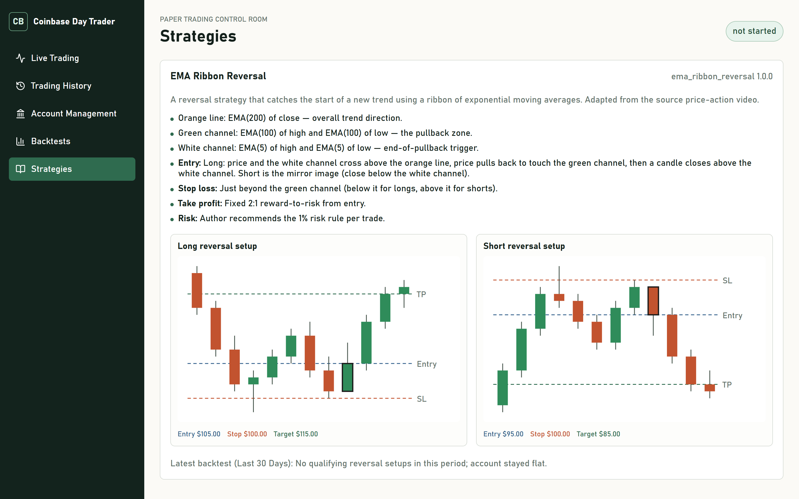
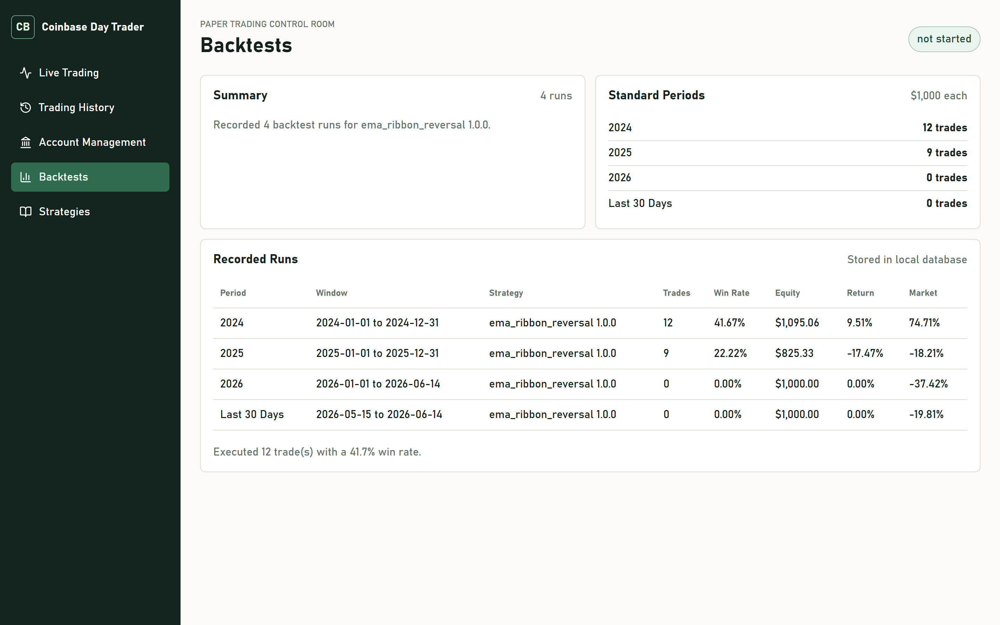

# Coinbase Day Trader v1

Local-first Coinbase crypto paper trading bot and dashboard.

## Financial Disclaimer

This project is experimental software. The owner is not a financial professional, and this repository does not provide financial advice. Do not use this software for live trading unless you understand the risks and have reviewed the code, configuration, exchange permissions, and strategy behavior yourself.

## Current Safety Mode

Version 0.2.0 supports local paper trading first. Coinbase integration is wired for sandbox/public API checks, but live order placement is intentionally blocked. The bot trades paper money only and stops permanently if equity falls to 50% of the starting balance until you run `trader reset-safety`.

## Quick Start

1. Copy `.env.example` to `.env`.
2. Fill only the values you need for local testing.
3. Install Python dependencies with `pip install -e .[dev]`.
4. Start the bot with `powershell -File scripts/start_bot.ps1 -Strategies ALL`.
5. Start the dashboard with `powershell -File scripts/start_dashboard.ps1`.

## Coinbase Setup

Create Coinbase API credentials from Coinbase Developer Platform or Advanced Trade with the least permissions needed for sandbox and market-data testing. Store keys only in `.env` or another ignored local secret file. Do not commit `.env`, `cdp_api_key.json`, or any API key export.

In v0.1.3, `TRADING_MODE=paper` is the safe default. `TRADING_MODE=coinbase_sandbox` is reserved for integration smoke checks. `TRADING_MODE=live` fails closed.

## Bot Commands

```powershell
trader start-bot --strategies ALL
trader start-bot --strategies price_action_transcript
trader reset-safety
```

The bot starts from 1000 USD paper cash. If equity falls to 500 USD or below, trading is disabled until `trader reset-safety` is run manually.

## Dashboard

Live trading control room with account metrics, current coin prices, and open/closed trade tables:


Strategy page with annotated candlestick examples (entry, stop-loss, take-profit) for the long and short setups:



Backtests page summarizing every standard period:



Run locally:

```powershell
powershell -File scripts/start_dashboard.ps1
```

The dashboard binds to all local network interfaces and runs on port `8011`. On this machine, use [http://127.0.0.1:8011](http://127.0.0.1:8011). From another device on the same network, use a LAN URL such as [http://192.168.0.191:8011](http://192.168.0.191:8011).

## Strategies

- `ema_ribbon_reversal`: an EMA ribbon reversal price-action strategy encoded from the source YouTube video transcript.
  - **Orange line** — EMA(200) of close for trend direction.
  - **Green channel** — EMA(100) of high and EMA(100) of low for the pullback zone.
  - **White channel** — EMA(5) of high and EMA(5) of low for the end-of-pullback trigger.
  - **Long:** price and white channel cross above the orange line, price pulls back to touch the green channel, then a candle closes above the white channel. Stop below the green channel; take-profit at 2:1 reward:risk. Short is the mirror image (paper trading is long-only spot, so short signals close open longs).

The Strategies page in the dashboard shows annotated candlestick chart examples for the long and short setups.

## Backtests

Standard periods are 2024, 2025, 2026, and the last 30 days. Each run starts with 1000 USD paper cash and simulates the strategy bar-by-bar, recording trade count, win rate, ending equity, total return, and max drawdown. Daily market data is downloaded from the Coinbase public API and cached under `data/market/` for reuse.

Run all standard backtests:

```powershell
trader run-backtests
```

## Email Notifications

Set `GMAIL_USER`, `GMAIL_APP_PASSWORD`, and `NOTIFY_EMAIL` in `.env` to receive emails (subject prefixed `AI-BOT`) when the bot starts/restarts and when paper trades open or close. If credentials are absent, notifications are silently skipped.

## Verification

Backend:

```powershell
pytest -v
```

Dashboard:

```powershell
npm --prefix dashboard test -- --run
npm --prefix dashboard audit --audit-level=moderate
```
